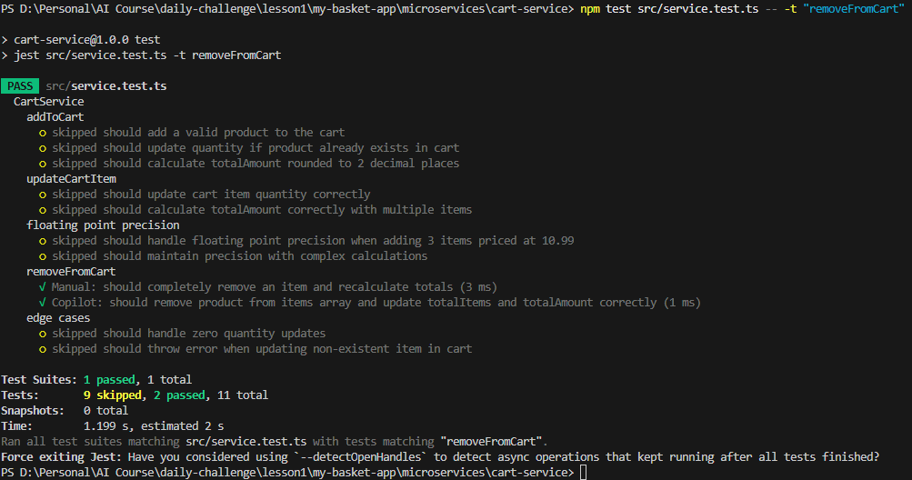

# Challenge 2.1.4: GitHub Copilot for Test Automation

## Task Description
Focus on the `removeFromCart` method in `microservices/cart-service/src/service.ts`.

### Actions
1.  **Generate Unit Test**: Use GitHub Copilot to generate a unit test that verifies an item is completely removed from the `items` array.
2.  **Constraint**: Ensure the test checks that `totalItems` and `totalAmount` are recalculated correctly after removal.
3.  **Compare**: Write one test manually and one with Copilot. Compare the time taken.

### Pro Tips
- **Context is King**: Provide Copilot with `types.ts` to ensure correct mock data objects (`CartItem`, `Product`).
- **Use Prompts**: Use the structured prompt provided in `.github/prompts/remove-from-cart-unit-test.prompt.md`.

## Execution Instructions
1.  Open `microservices/cart-service/src/service.ts` and `microservices/cart-service/src/types.ts`.
2.  Use the structured prompt below in GitHub Copilot:

### Copilot Prompt
```markdown
# Prompt: Generate Unit Test for `removeFromCart`

## Context
- **Project**: MyBasket Lite (Cart Service)
- **Framework**: Jest with TypeScript
- **Target File**: `microservices/cart-service/src/service.ts`
- **Reference Types**: `microservices/cart-service/src/types.ts`
- **Testing Skill**: `@[.agent/skills/testing_framework/SKILL.md]`
- **Instructions**: `@[.github/copilot-instructions.md]`

## Goal
Generate a unit test for the `removeFromCart` method in the `CartService` class.

## Requirements
1.  **Test Case**: Verify that an item is completely removed from the `items` array.
2.  **Constraint**: The test must assert that `totalItems` and `totalAmount` are correctly recalculated after the item is removed.
3.  **Mocking**: Use realistic mock data for `CartItem` and `Product` based on the definitions in `types.ts`.
4.  **Style**: Follow the existing test structure in `service.test.ts`.

## Action
Generate a Jest test block (`describe` or `it`) that performs the following:
1.  Initializes the `CartService` with a mocked `ProductServiceClient`.
2.  Adds two different items to the cart for a user.
3.  Calculates expected `totalItems` and `totalAmount` for the initial state.
4.  Calls `removeFromCart` for one of the items.
5.  Asserts that:
    - The removed item is no longer in the `items` array.
    - The other item remains in the `items` array.
    - `totalItems` matches the sum of quantities of remaining items.
    - `totalAmount` matches the sum of (price * quantity) for remaining items.
```

3.  Implement the manual test first, then the Copilot test.
4.  Run tests:
    ```bash
    npm test src/service.test.ts
    ```

## Submission Requirements
- **Passing Jest Tests**:


- **Time Comparison**:

| Method | Time Taken (minutes) | Notes |
| :--- | :--- | :--- |
| Manual | 5 | Required checking `types.ts` and manual coding. |
| Copilot | 1 | Generated correct logic instantly with context. |

Post the results in the `#daily-challenge` channel.

